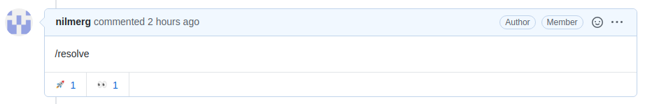

# Contributing to Icinga L10n

If you are already familiar with [gettext](https://www.gnu.org/software/gettext/manual/gettext.html#Why),
contributing here is rather straightforward.

Assuming you already [forked](https://help.github.com/en/github/getting-started-with-github/fork-a-repo)
the repository you will find all important files in here:

* locale (Compiled catalogs and their source files)
* src (The template and intermediate catalogs)

The `locale` directory stores all current compiled translations. It also contains the
*.po* files used to compile them. These files must pass the validation checks and hence
must be error-free and must not contain fuzzy messages.

The `src` directory is where you will work on the translations. It contains the current
template and intermediate catalogs, which are automatically kept up to date on a daily
basis. To fetch the latest update just pull the `master` branch.

## Working on Translations

To start working on a translation, please use your favorite editor. Though, we highly
recommend [Poedit](https://poedit.net/) as we already prepared the intermediate catalogs
for it. It is easy to use as well.

When adding/updating translations for an existing language, please open the respective
*.po* file in e.g. `src/de_DE/LC_MESSAGES/icinga.po`. To start from scratch with a new
language, copy the template `src/icinga.pot` and use it to create a new catalog in e.g.
`src/zh_CN/LC_MESSAGES/icinga.po`.

When you are done please make sure your changes do not contain any errors or fuzzy
messages. You can then copy the file to the respective locale in `locale` together with
its compiled *.mo* file. (No *.mo* file? *Poedit* can automatically create them upon
saving, check its configuration.)

To send us your work please open a new [pull request](https://help.github.com/en/github/collaborating-with-issues-and-pull-requests/creating-a-pull-request)
and include the following files in it:

* `src/ll_CC/LC_MESSAGES/icinga.po`
* `locale/ll_CC/LC_MESSAGES/icinga.po`
* `locale/ll_CC/LC_MESSAGES/icinga.mo`

## Keeping Pull Requests up-to-date

As mentioned above, the master branch gets updated frequently. Once new messages get
introduced in a linked repository (such as Icinga Web 2) the template and source catalogs
will be updated. To get these new messages into your fork, just update it with our current
master. Github also lets you update your pull request right from the UI.

Though, sooner or later you will get conflicts, and a simple update of your pull request
is not possible anymore. You need to resolve the conflicts first then, in order to update.

Our source catalogs however are huge. A few conflicts may be fixable by hand, but many of
them can be a pain. We don't recommend fixing conflicts by hand, but provide a bot which
will take care of them automatically.

> **Note:**
>
> To utilize the bot, it is required to enable maintainer edits.

If you want the bot to resolve source catalog conflicts and update your pull request,
add a comment with `/resolve` in the first line.

The bot will then immediately attempt to fix your source catalog conflicts. Once the bot
finished its work, it will leave a comment. Pull its changes then and continue with the
translation.

Pulling the bot's changes is important. Once you trigger the bot, it's not only you
anymore who's working on the pull request. It's then also the bot which is adding
commits. To avoid conflicts in your working tree, it is recommended to pull the remote
branch first before continuing with the translation.
